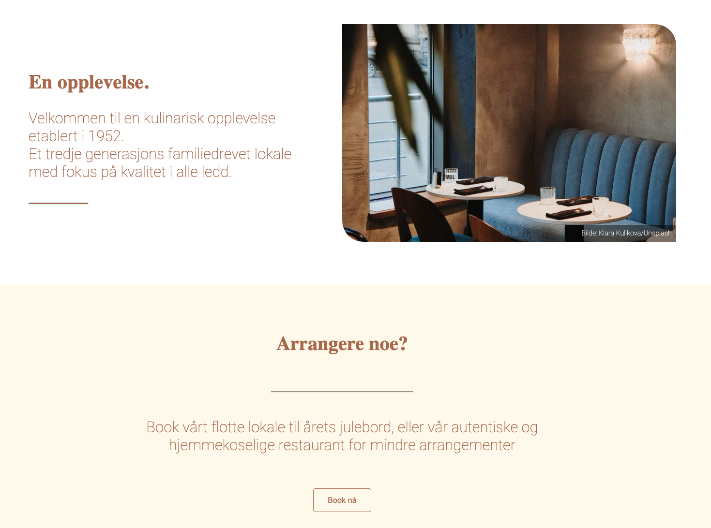
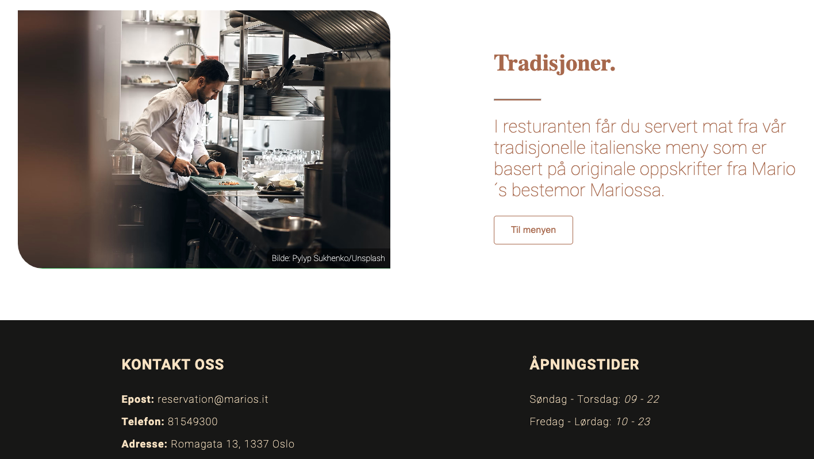

Link til siden: https://haraldeskeland.github.io/Restaurant-nettside/

# Restaurant Nettside Prosjekt

Dette prosjektet var en del av vår skoleeksamen, hvor vi som en gruppe på fire studenter har utviklet en fullverdig nettside for en restaurant. Nettsiden inkluderer flere sider: Forside, Bookingside, Meny, en kreativ side, og en side som beskriver vår arbeidsprosess. Dette var eksamen første semester på studiet så den er av naturlige årsaker ikke svært kompleks.

## Min rolle
I dette prosjektet hadde jeg hovedansvar for å utvikle forsiden og et design/tema som skulle gå gjennom resten av nettsiden med footer, header logo etc.
Vi hadde i tillegg et tett samarbeid med hverandres sider som fungerte godt.

## Forside

Forsiden gir en innbydende introduksjon til restauranten med attraktive bilder og en kort beskrivelse. Denne siden er designet for å fange besøkendes oppmerksomhet og gi en oversikt over hva restauranten tilbyr.
Den har en navigation bar, footer og linker til de andre delene av nettsiden som booking og meny.

## Bookingside

På bookingsiden kan kunder enkelt reservere bord ved å fylle ut et skjema med nødvendige detaljer som navn, antall gjester, dato og tidspunkt. Systemet bekrefter reservasjonen og gir tilbakemelding til kunden.

## Meny

Menysiden viser en detaljert oversikt over restaurantens retter, delt inn i kategorier som forretter, hovedretter og desserter. Hver rett er presentert med beskrivelse, pris og eventuelle spesialtilbud.

## Teknologier Brukt

- HTML
- CSS
- JavaScript

Nettsiden er også optimalisert for widescreen og mobil/nettbrett.
